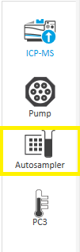
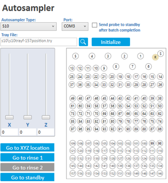

# Purging and Conditioning Procedure for Perkin Elmer NexION 2000 ICP-MS
022324MB01
# Scope
This procedure details the conditioning/preparation of the dynamic reaction cell (DRC).
# Responsibility
This procedure should be performed either by the Instrumentation Specialist, or under direct supervision of the Instrumentation Specialist.  Due to the inherent sensitivity of a mass spectrometer and the use of caustic solutions, gloves should be worn at all times when working at the front of the instrument.

# References
Instrument birth certificate as needed.

# Definitions
1. **Dynamic Reaction Cell (DRC)** - A cell placed after the ion optics but before the mass analyzer quadrupole.  The DRC is capable of <i> both </i> ion-molecule collisions/reactions to cleanse the ion beam of interferents.  When used in collision mode,<i> Kinetic Energy Discrimination </i> is used to reject any undesired products.  When used in reaction mode, a reaction gas (ammonia, oxygen, etc.) is introduced into the cell to stimulate ion-molecule reactions.  The choice of gas is determined by thermodynamics to favor exothermic (spontaneous) reactions, due to the ionization potential of the interferent ion being much larger than the reaction gas.
1. **Kinetic Energy Discrimination (KED)** - One way to remove interferent ions.  A low reactive gas (typically He) is used to induce collisions with the polyatomic interferent.  Because the interferent has a larger collision cross-section (due to its larger size than that of the analyte ion), it will collide more frequently with the gas, and thus lose more kinetic energy.  By placing an energy barrier at the exit of the cell, the lower energy the lower energy interferent can be eliminated.

# Required Reagents
1. 5% Nitric Acid Solution (Made from Trace Metals Grade Nitric Acid).
1. 10% NH3 in He gas.
1. UHP (or better) O2 gas.
1. UPC (or better) He gas.
1. Swagelok VCR Connections (if changing tanks)

# DRC and KED Gas Cylinder Changing
The required input pressure for the DRC and KED are 15 psi and 25 psi, respectively, as indicated by the pressure gauge on the regulator.  The gas cylinder needs to be changed whenever these pressure requirements are not met.  VCR gaskets are **<u>single use only</u>.**  Parts labeled as **"DNR"** should not be removed on the regulator.
1. Close the cylinder shutoff valve with the regulator still attached.
1. In the software, in the **Instrument** window **Diagnostics** tab, in the Filter list, click **Gas Flow Control**.
1. Ensure the flow of the gas to be replaced is 0.
1. Close the regulator shutoff valve to help keep out any air, and then disconnect the regulator from the old cylinder.
1. Place the regulator on the new tank.
1. Open the cylinder shutoff valve.
1. Open the regulator shutoff valve.  Flip the purge switch on the side of the instrument up for about 2 - 3 mins.
1. Close the purge switch.
1. Proceed with the optimization for the replaced gas below.

# Plasma Gases and Startup
1. Turn the chiller on by pressing its power button.  Allow the chiller sufficient time to reach 15 C.
1. The ICP-MS uses argon gas for the plasma.  The argon can be turned on using the main valves of the four cylinders.
  >**85 - 95 PSI of argon is required!**

3. Wearing gloves, visually inspect the tubing of both peristaltic pumps for the autosampler and instrument.  Replace the tubing if there is any obvious holes or flat spots.
4. Wearing gloves, affix the tubing to the peristaltic pumps making sure not to cross over each line with another.  The pump on the ICP-MS rotates counterclockwise to introduce the sample into the spray chamber.
5. Clamp the tubing to the pumps.  The ICP-MS pump has a "Tube saver" feature, so you may observe it rotating clockwise and then counterclockwise.
1.
1. Open the Syngistix software by clicking the icon on the desktop.  The launch window of the software is shown below.
      
      > A red icon indicates a system fault.  The image shows an argon gas fault due to the cylinders being off as an example.

8. The instrument's cones, including the sample cone, skimmer cone and hyper skimmer cone, should all be inspected prior to use.  Replace any worn cone to ensure optimum beam transmission.
1. With the cones inspected and satisfactory, the plasma can be ignited.
1. Click the toggle switch located under **Plasma** in the main Syngistix window.  The plasma ignition process will initiate.
1. Allow the plasma to stabilize for 20 mins prior to any analysis, including the next steps.
1. The picture below shows the status screen after the plasma has been successfully ignited.
      

12. Initialize the autosampler by clicking the **Autosampler** icon in the left-hand toolbar shown below in yellow.
      
1. Click the **Initialize** button to establish connection to the autosampler.  The screen should look like the image below if the communication is successful.
      
>Ensure that the probe is **NOT** sent to standby after batch completion.

14. Proceed to the Workspace procedure below after the plasma has had 20 minutes to stabilize.

# Workspace Procedure
1. Click **File** and navigate to **Workspace** and select **Open Workspace.**
1. Select the **Conditioning the cell for KED Mode manual.wrk** workspace file and click **Open.**

# Loading Conditioning Conditions
1. Navigate to the **Conditions** tab.
1. Click **File** followed by **Open.**
1. Select the **Cell Conditioning.dac** Conditions file and click **Open.**
>The difference between the Default and Cell Conditioning files is that the Cell Conditioning file loads a lower argon flow rate due to the procedure requiring extended times with the plasma on.

# Loading the Conditioning Method
>The steps below detail the files for KED mode.  If other gases (O2 or NH3) are to be used, select the files labeled for those gases.

1. Click on the **Method** icon.
1. Click the **Syngistix ball** followed by open.  Locate the method **Conditioning the cell for KED mode manual** and load it.
>The flow rate for the helium should be quite high, ~ 6.

3. Place the autosampler probe into the 2-L bottle filled with the nitric acid wash solution.

# Batch Sample analysis
1. Click on the **Sample** icon.
1. Because the Conditioning Workspace was loaded previously, the sample table should be filled out already and resemble that as shown below.
      
1. Click the **Batch Index** tab to select all the samples.
1. Click the **Analyze Batch** button.
1. When the **Run List** window opens, ensure that **Autostop** is checked and that **Stop Criteria is set to Batch Completed.**  This will tell the instrument to kill the plasma when the conditioning has been completed as the conditioning can take ≥ 12 hours.

### Optimizing for KED Mode
Optimize the torch position, nebulizer gas and QID in standard mode first, then perform a standard performance check.  Save the **Mass Calibration** and **Conditions** as **default.**
#### KED Mode QID
1. Select the **Conditions** page.
1. Enter a value of 475 for KED **Axial Field Voltage (AFT).**  This is a typical value.
      
1. Save the Conditions file as **default.dac.**
1. Navigate to the Smarttune window by clicking the Smarttune icon located in the top toolbar of Syngistix.
1. Click the **Syngistix Ball** followed by **Open** and select the Smarttune Wizard File labelled as **"KED."**  
The optimization list should resemble that shown below.
      
1. Begin aspirating the NexION Setup Solution.
1. Click the **QID** optimization and ensure that **KED QID** is checked as shown below.
      
1. Right-click on the **QID** in the optimization list and select **Quick Optimize.**  When the procedure is complete, the optimization curves appear in the Optimization Details of the SmartTune Results screen and in the Realtime Screen.
1. To assess the quality of the optimization curves, look for the curves increasing, attain a max point, and then decrease (appearing like a mountain).  A correlation of 0.99 is best and the Deflector Voltage vs. Mass should have a sigmoidal(ish) curve.
1. Save the conditions file by selecting the **Conditions** tab and saving the file as **Default.dac.**

#### KED Cell Gas optimization
1. The cell gas is optimized (in this procedure) for two different flows, a high and low flow.
1. Aspirate the **KED Setup Solution.**
1. Click on the **Method** icon.
1. Click the Syngistix ball followed by open.  Locate the method **Optimize - Helium.mth** and load it.
1. Select the **Advanced Optimize** tab and select the Cell gas to be optimized for KED mode.  This screen is shown below.
      
1. In the **Parameter Range** column, use a Start Value of 3.0, an end value of 6.0 and a step value of 0.1.
1. In the **Cell Parameters** table, select **Co** as the analyte.
1. Select **Formula** under **Optimization Criteria.**
1. Select **ClO/Co <0.005.**  
1. After ensuring the KED Setup Solution has reached the spray chamber, click the **Optimize** button.
1.  Setting the real time display in a logarithmic scale will shows the separation in signal.
1. After the readings are completed, return the autosampler to the rinse location.  The Cell Parameters table will now have a value under the helium column.
1. Within the Advanced Optimize window, click the **Cell Parameters** tab to record the high and low flow values.
      

#### KED Methods Update
1. There are three methods that will be updated with the cell gas flows obtained above.  They include **Optimize - Helium,** **Detection Limits KED,** and  **KED Performance Check.**
1. In the Method screen, open the **Optimize - Helium.mth** method.  Enter the high flow value of the He Cell gasses obtained in the KED Cell Gas Optimization procedure for all the analytes.  Save the method file.
1. In the Method screen, open the **Detection Limits KED** method.  Enter the value of the He Cell gasses obtained in the KED Cell Gas Optimization procedure for all the analytes. High flow for V. Low flow for As and Se.  Save this method file.
1. In the Method screen, open the **KED Performance Check** method.  Enter the value of the He Cell gasses obtained in the KED Cell Gas Optimization procedure for all the analytes. High flow for ClO-hi, Co-hi, CeO-hi, Ce-hi, Ar2-hi, and Kr-hi.  Low flow for ClO-lo, Co-lo.  Save this method file.

#### KED Cell Entrance Voltage
1. Aspirate the **KED Setup Solution.**
1. Navigate back to the Smarttune window with the "KED" optimization file still loaded.
1. Under Optimization select **KED Mode Cell Entrance Voltage.**
1. Right-click on **KED Mode Cell Entrance Voltage** and select **Quick Optimize.**
1. The correct reading will be entered into Manual Adjust tab of the Conditions screen.
1. Save the conditions file by selecting the Conditions screen and saving the file as default.dac.

#### KED Cell Exit voltage
1. Aspirate the **KED Setup Solution.**
1. Navigate back to the Smarttune window with the "KED" optimization file still loaded.
1. Under Optimization select **KED Mode Cell Exit Voltage.**
1. Right-click on **KED Mode Cell Exit Voltage** and select **Quick Optimize.**
1. The correct reading will be entered into Manual Adjust tab of the Conditions screen.
1. Save the conditions file by selecting the Conditions screen and saving the file as default.dac.

#### KED Quadrupole Rod Offset (QRO)
1. In the **Manual Adjustment** section of the **Conditions** tab, select **KED Mode QRO**.
1. Enter a value of **-12.**
1. Save the updated Conditions as **default.dac.**

#### KED Cell Rod Offset (CRO)
1. Aspirate the **KED Setup Solution.**
1. Navigate back to the Smarttune window with the "KED" optimization file still loaded.
1. Under Optimization select **[Helium KED] CRO.**
1. Right-click on **[Helium KED] CRO** and select **Quick Optimize.**
1. The correct reading will be entered into Manual Adjust tab of the Conditions screen.
1. Save the conditions file by selecting the Conditions screen and saving the file as **default.dac.**
>This value is typically -15V. This is equal to 3 volts difference than the QRO.

#### KED Mode QID
>Even though the QID was done earlier, it is recommended to done again

1. Aspirate the **NexION Setup Solution.**
1. In the SmartTune screen with the **KED** optimization file loaded, select **KED Mode QID.**
1. Right-click on **KED Mode QID** and select **Quick Optimize.**
1. When the procedure is complete, the optimization curves appear in the Optimization Details of the SmartTune Results screen and in the Interactive Screen.
1. Check that you have obtained a good optimization curves. The curves should increase, attain a maximum point, and then decrease (appearing like a mountain).
1. If the curves are not satisfactory: Verify that the solution is correct and is being properly introduced into the system and repeat the optimization.
1. The KED Mode QID™ curve is stored in the Conditions file.
1. Save the conditions file by selecting the Conditions screen and saving the file as default.dac.

#### KED Axial Field Voltage Optimization
1. Aspirate the **KED Setup solution.**
1. In the Method screen, open the method **Optimize - Helium.mth.**
1. Select the **Advanced Optimize** tab and select **Co** for the Analyte.
1. Select **Maximum Intensity** under **Optimization Criteria.**
1. Enter the high flow for KED, determined earlier into the appropriate gas in the Cell Parameters.
1. After the solution has reached the spray chamber and is stable, click on the Optimize icon.
1. After the readings are completed, place the capillary in the Rinse solution.
1. The AFT Voltage reading will be entered into the Conditions file.
>This value is typically set to 475 volts.

9. Save the conditions file by selecting the **Conditions** tab and saving the file as **default.dac.**

#### KED Performance Check
1. Aspirate the **KED Setup solution.**
1. In the SmartTune screen with the **KED** optimization file loaded, select **KED Performance Check.**
1. Right-click on **KED Performance Check** and select **Quick Optimize.**
1. When the procedure is complete, verify that the values meet the specifications. These values are listed on the Performance Checklists. Results can be viewed in the Reporter and Log Book.
1. Save the conditions file by selecting the **Conditions** tab and saving the file as **default.dac.**
1. Proceed to the Method Creation and Analysis section.

### Optimizing for NH3 DRC Mode
>**The use of the cell requires an overnight purge performed by Matt Burleson!**

#### NH3 DRC Cell Gas Optimization
1. Aspirate the **Detection Limit STD/DRC Mode Blank** solution provided
1. In the Method screen, open the method **Cell Gas Optimization.mth.**
1. For good organization, create a new Dataset for collecting DRC parameter optimization data.
  1. Select the **Dataset** screen.
  1. Select the Syngistix Menu and **New**. Create dataset that best describes the task you are doing. For example: DRC Optimization.
1. Select **Advanced Optimize** and select **Gas Flow.**
1. In the **Parameter Range**, use a Start Value of **0.1**, an End Value of **1.0**, and a Step Value of **0.1.**
1. In the Cell parameters, enter an **RPq** value of **0.45.**
1. Select **Ramp** under Optimization Criteria.
1. Under the **Manual** tab of the **Sample** screen, enter an appropriate name for this solution: For example: **Matrix Blank Cell Gas A.** It is a good practice that this name created is descriptive. It will be used later when retrieving data. Make sure the **Write Data to Dataset** is checked.
>**Note:** **DO NOT** select any of the Analyze buttons on this screen.

9. Return to the **Advanced Optimize** tab.  Start the optimization routine by clicking on the **Optimize** icon.
1. When the routine is done, aspirate the **NexION Setup** solution.
1. Under the **Manual** tab of the **Sample** Screen, enter an appropriate name for this solution: For Example: **Matrix Spike Cell Gas A.**
>**Note:** **DO NOT** select any of the Analyze buttons on this screen.

12. Return to the **Advanced Optimize** tab. After making sure that the solution has reached the nebulizer, start the optimization routine by clicking on the **Optimize** icon.
1. After the readings are completed, place the capillary in the **Rinse** solution.

#### Analyzing the Data
1. Activate the **Charting** screen and select the **Function** button.
1. Click on the **Composite Samples...** button. The Composite Signal options dialog box will appear.
1. Select **LOD** under the Calculation.
> Note: LOD may be better for simple matrices and BEC may be better for more complex matrices. LOD is more dependent on concentration and integration times, while BEC is not dependent on these variables.

4. Enter **1 ppb** as the Spike Concentration.
1. Browse for the Blank by clicking the magnifying glass for **Sample 1** and select the file created for Matrix Blank solution (previously named **Matrix Blank Cell Gas A** above).
1. Browse for the Standard by clicking the magnifying glass for **Sample 2** and select the file created for Matrix Spike solution (previously named **Matrix Spike Cell Gas A** above).
1. Click **Calculate** to interpret the data.
1. Determine the flow rate for the best LOD. The lowest point on the plot is the best LOD.
>Note: You may have to change the plot to log scale to see the lowest point.

#### Optimizing CPV, CRO, and QRO in NH3 DRC Mode
In DRC mode, the cell is filled with a reactive gas so the necessary voltages will change. Only one analyte is necessary for optimization.  These parameters change very little from analyte to analyte. These values should not change.

#### Cell Path Voltage Method DRC Update
1. Open the **Cell Path Voltage - Ammonia.mth** method in the Method screen.
1. Enter the value of the NH3 Cell gas obtained in the Cell Gas Optimization procedure for all the analytes.
1. Save this method file.

#### DRC Mode Cell Entrance/Exit Voltage Optimization
1. Aspirate the **NexION Setup Solution.**
1. Navigate to the **SmartTune** screen.
1. Open the **Ammonia DRC.swz** SmartTune File.
1. On the SmartTune screen, right-click on **[Ammonia DRC] Cell Entrance/Exit Voltage** and select **Quick Optimize.**  This value calculated is -2 volts from the largest drop.
1. This value will be entered into the **Manual Adjust** portion of the **Conditions** screen.
>Note: the maximum value may not always be the best setting.  Check the value from the installation datasheet (on top of instrument).  If the value is **<i>more negative</i>** than the value determined, enter the value from the datasheet.

6. Save the Conditions file as **default.dac.**

#### DRC Mode CRO (Cell Rod Offset) Optimization
1. Aspirate the **NexION Setup Solution.**
1. With the **Ammonia DRC.swz** SmartTune File still open, right-click on **[Ammonia DRC] CRO** and select **Quick Optimize.**
1. This value will be entered into the **Manual Adjust** portion of the **Conditions** screen.

#### DRC Mode QRO (Quadrupole Rod Offset)
1. The value for the QRO is automatically set by the **DRC Mode CRO.**
1. The value is set to -7 V lower than the determined value as shown below.  This relationship maintains the abundance sensitivity.

a. <i> QRO </i> = <i>CRO</i> - 7.0.

1. Save the conditions file as **default.dac.**

#### NH3 DRC AFT (Axial Field Voltage)
1. The typical value for Ammonia DRC is 200.

#### NH3 DRC Installation Performance Verification
1. Open the **DRC Performance Check** method.
1. Change the flow under the Ammonia column to be that which was found earlier to be optimum.  Save the method.
1. Aspirate the **NexION Setup Solution.**
1. Right-click on **[Ammonia DRC] Performance Check** and select **Quick Optimize.**
1. When the procedure is complete, verify the value meets specifications.

### Optimizing for O2 DRC Mode
>**The use of the cell requires an overnight purge performed by Matt Burleson!**

#### O2 DRC Cell Gas Optimization
1. Aspirate the **Detection Limit STD/DRC Mode Blank** solution provided
1. In the Method screen, open the method **Cell Gas Optimization O2.mth.**
1. For good organization, create a new Dataset for collecting DRC parameter optimization data.
  1. Select the **Dataset** screen.
  1. Select the Syngistix Menu and **New**. Create dataset that best describes the task you are doing. For example: DRC Optimization.
1. Select **Advanced Optimize** and select **Gas Flow.**
1. In the **Parameter Range**, use a Start Value of **0.1**, an End Value of **2.0**, and a Step Value of **0.1.**
1. In the Cell parameters, enter an **RPq** value of **0.45.**
1. Select **Ramp** under Optimization Criteria.
1. Under the **Manual** tab of the **Sample** screen, enter an appropriate name for this solution: For example: **Matrix Blank.** It is a good practice that this name created is descriptive. It will be used later when retrieving data. Make sure the **Write Data to Dataset** is checked.
>**Note:** **DO NOT** select any of the Analyze buttons on this screen.

9. Return to the **Advanced Optimize** tab.  Start the optimization routine by clicking **Optimize.**
1. When the routine is done, aspirate the **AFT Multi-Element Solution** solution.
1. Under the **Manual** tab of the **Sample** Screen, enter an appropriate name for this solution: For Example: **Matrix Spike.**
>**Note:** **DO NOT** select any of the Analyze buttons on this screen.

12. Return to the **Advanced Optimize** tab. After making sure that the solution has reached the nebulizer, start the optimization routine by clicking **Optimize.**
1. After the readings are completed, place the capillary in the **Rinse** solution.

#### Analyzing the Data
1. Activate the **Charting** screen and select the **Function** button.
1. Click on the **Composite Samples...** button. The Composite Signal options dialog box will appear.
1. Select **LOD** under the Calculation.
> Note: LOD may be better for simple matrices and BEC may be better for more complex matrices. LOD is more dependent on concentration and integration times, while BEC is not dependent on these variables.

4. Enter **2 ppb** as the Spike Concentration.
1. Browse for the Blank by clicking the magnifying glass for **Sample 1** and select the file created for Matrix Blank solution (previously named **Matrix Blank** above).
1. Browse for the Standard by clicking the magnifying glass for **Sample 2** and select the file created for Matrix Spike solution (previously named **Matrix Spike** above).
1. Click **Calculate** to interpret the data.
1. Determine the flow rate for the best LOD. The lowest point on the LOD plot is the best LOD and is typically 0.3 -1.5 mL/min.

#### Optimizing CPV, CRO, and QRO in DRC Mode
In DRC mode, the cell is filled with a reactive gas so the necessary voltages will change. Only one analyte is necessary for optimization.  These parameters change very little from analyte to analyte. These values should not change.

#### Cell Path Voltage Method DRC Update
1. Open the **Cell Path Voltage - Oxygen.mth** method in the Method screen.
1. Enter the value of the O2 Cell gas obtained in the Cell Gas Optimization procedure for all the analytes.
1. Save this method file.

#### Oxygen DRC Performance Check Method DRC Update
1. Open the **Oxygen DRC Performance Check.mth** method in the Method screen.
1. Enter the value of the O2 Cell gas obtained in the Cell Gas Optimization procedure for all the analytes.
1. Save this method file.

#### DRC Mode Cell Entrance/Exit Voltage Optimization
1. Aspirate the **AFT Multi-Element Solution.**
1. Navigate to the **SmartTune** screen.
1. Open the **Oxygen DRC.swz** SmartTune File.
1. On the SmartTune screen, right-click on **[Oxygen DRC] Cell Entrance/Exit Voltage** and select **Quick Optimize.**  This value calculated is -2 volts from the largest drop.
1. This value will be entered into the **Manual Adjust** portion of the **Conditions** screen.
1. Save the Conditions file as **default.dac.**

#### DRC Mode CRO (Cell Rod Offset) Optimization
1. Aspirate the **AFT Multi-Element Solution.**
1. With the **Oxygen DRC.swz** SmartTune File still open, right-click on **[Oxygen DRC] CRO** and select **Quick Optimize.**
1. This value will be entered into the **Manual Adjust** portion of the **Conditions** screen.

#### DRC Mode QRO (Quadrupole Rod Offset)
1. The value for the QRO is automatically set by the **DRC Mode CRO.**
1. The value is set to -7 V lower than the determined value as shown below.  This relationship maintains the abundance sensitivity.

a. <i> QRO </i> = <i>CRO</i> - 7.0.

1. Save the conditions file as **default.dac.**

#### DRC AFT (Axial Field Voltage)
1. Aspirate the **AFT Multi-Element Solution.**
1. Open the **Cell Path Voltage - Oxygen.mth** method in the Method screen.
1. Select **Advanced Optimize** then select **Axial Field Voltage.**
1. Under **Cell Paramters**, change the analyte to **AsO.**
1. In the Cell parameters, enter an **RPq** value of **0.45.**
1. Select **Maximum Intensity** under Optimization Criteria.
1. Click **Optimize.**
1. This value will be entered into the **Manual Adjust** portion of the **Conditions** screen.
1. Save the conditions file as **default.dac.**

#### DRC Installation Performance Verification
1. Aspirate the **AFT Multi-Element Solution.**
1. Go back to the **SmartTune** window.
1. Right-click on **Lab Performance Check** and select **Quick Optimize.**
1. When the procedure is complete, verify the values meets specifications.
