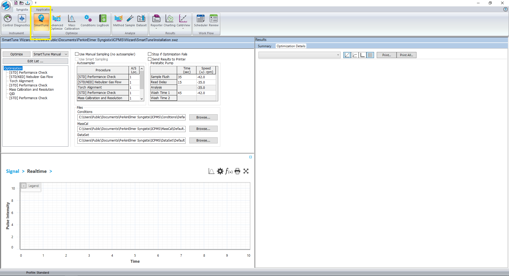
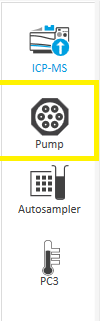
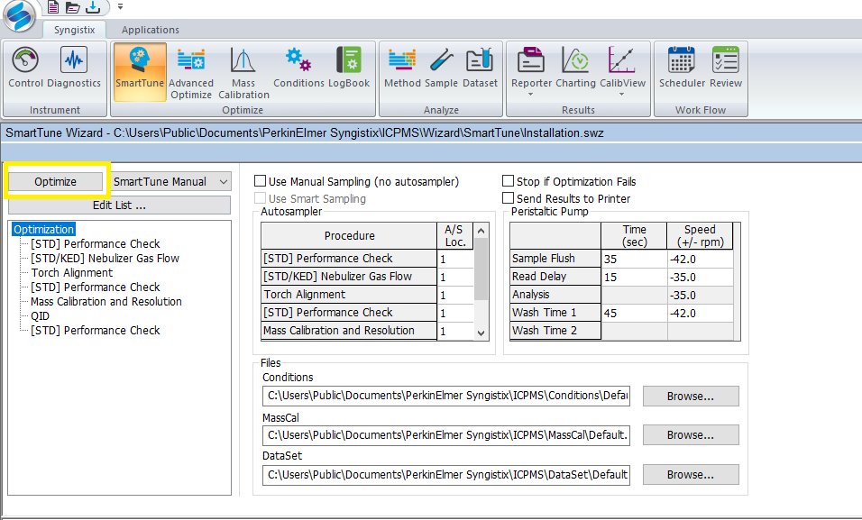
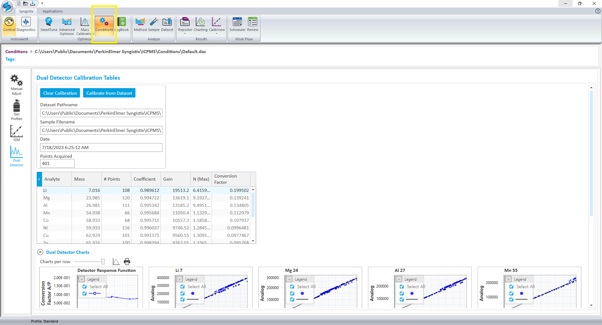
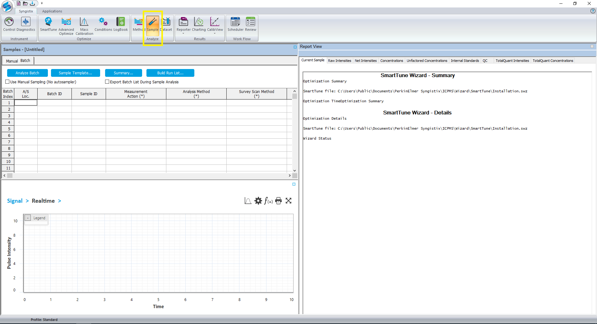
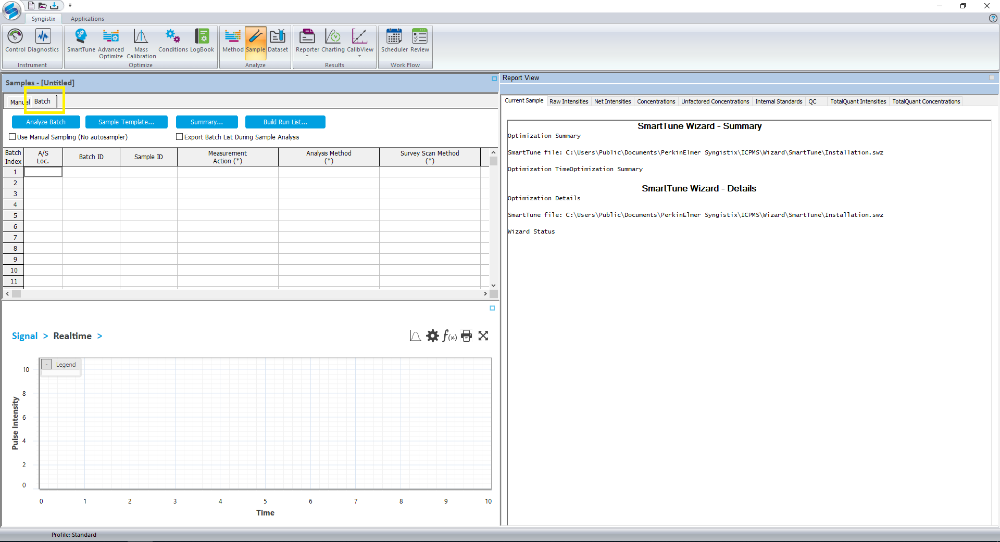

# Operation of Perkin Elmer NexION 2000 ICP-MS
072023MB01
>**For urgent problems please report to Matt Burleson, AP 346, mburleson@wcu.edu, x2239!***

# Scope
This procedure details the operation of the ICP-MS including initial tuning and setup.

# Responsibility
Due to the inherent sensitivity of a mass spectrometer and the use of caustic solutions, gloves should be worn at all times when working at the front of the instrument.

**10 ppm should be the highest concentration.**

# Definitions
1. EDR - Extended Dynamic Range - provides an electronic dilution that enables the analyst to use the quadrupole in the universal cell to detune sensitivity on specific high concentration elements, so that they can be used with the same low concentration elements in the same calibration.  This mode can be useful for the detection of magnesium, calcium, iron and sodium.

# Required Reagents
1. NexION Setup Solution.
1. NexION Rinse solution.
1. 3% Nitric Acid Solution (Made from Trace Metals Grade Nitric Acid).

# Gases and Startup
1. Turn the chiller on by pressing its power button.  Allow the chiller sufficient time to reach 15 C.
1. The ICP-MS uses argon gas for the plasma.  The argon can be turned on using the main valves of the four cylinders.

>**85 - 95 PSI of argon is required!**

3. Wearing gloves, visually inspect the tubing of both peristaltic pumps for the autosampler and instrument.  Replace the tubing if there is any obvious holes or flat spots.
4. Wearing gloves, affix the tubing to the peristaltic pumps making sure not to cross over each line with another.  The pump on the ICP-MS rotates counterclockwise to introduce the sample into the spray chamber.
5. Clamp the tubing to the pumps.  The ICP-MS pump has a "Tube saver" feature, so you may observe it rotating clockwise and then counterclockwise
6. Open the Syngistix software by clicking the icon on the desktop.  The launch window of the software is shown below.
      
      > A red icon indicates a system fault.  The image shows an argon gas fault due to the cylinders being off as an example.

1. The instrument's cones, including the sample cone, skimmer cone and hyper skimmer cone, should all be inspected prior to use.  Replace any worn cone to ensure optimum beam transmission.
>**This requires training by Matt Burleson!**

8. With the cones inspected and satisfactory, the plasma can be ignited.
1. Click the toggle switch located under "Plasma" in the main Syngistix window.  The plasma ignition process will initiate.
>**Contact Matt Burleson if the plasma fails to ignite after two attempts.**

10. Allow the plasma to stabilize for 15 mins prior to any analysis, including the next steps.
1. The picture below shows the status screen after the plasma has been successfully ignited.
      
1. Initialize the autosampler by clicking the "Autosampler" icon in the left-hand toolbar shown below in yellow.
      
1. Click the "Initialize" button to establish connection to the autosampler.  The screen should look like the image below if the communication is successful.
      
>Ensure that the probe is **NOT** sent to standby after batch completion.

14. Proceed to the Smarttune procedure after the plasma has had 15 minutes to stabilize.

# SmartTune Procedure
1. Navigate to the Smarttune window by clicking the Smarttune icon located in the top toolbar of Syngistix.  The Smarttune icon is shown below in yellow.
      
1. Click "File" followed by "Open" and select the Smarttune Wizard File labelled as "Installation."  
The optimization list should resemble that shown below.
      
>The optimizations are performed in order.  If one fails, the instrument moves onto the next item in the list in an attempt to correct the previous failure.

3. Ensure that the location of the NexION Setup Solution vial matches that shown in the Autosampler dialog box below within the Smarttune window.
      
1. Navigate to the "Pump" tab in the left-hand toolbar shown in yellow below.
      
1. The Setup Solution needs to be in aspirated into the system before the Smarttune procedure is initiated.  Change the "Pump Speed" to "-100" and press enter.
        
1. Allow the pump to operate at this speed for about 20 seconds to allow the Setup Solution to enter the nebulizer.
1. After the Setup Solution has had sufficient time to enter the nebulizer, change the pump speed back to "-35" and press enter.
1. Navigate back to the Smarttune window.
1. Click the "Optimize" button shown below to begin the optimization process.
      
1. As the optimization process proceeds, it's better to change the Signal window to numeric for a more usable reading.  This can be done by clicking the curve icon below in yellow and selecting "Numeric."
      
1. The software will prompt you to save the results of the optimization.  These should be saved as the date they are performed.
1. Navigate to "Mass Calibration"
      
1. Save the Mass Calibration following the optimization by clicking the top-left icon followed by "Save As."
>**Save as "Default".**

14. Navigate to "Conditions" shown below in yellow.
      
1. Save the Conditions following the optimization by clicking the top-left icon followed by "Save As."
>**Save as "Default".**

16. This concludes the optimization of the instrument.  The method can now be built following the next procedure.

# Method Creation and Analysis
1. Navigate to the "Methods" tab shown below in yellow.
      

1. Click the top-left icon followed by "New."
1. A popup (shown below) will ask for the desired analysis type.  Select the appropriate method type.  The instructions below are for a quantitative method.
      

4. Add your desired analytes using the periodic table to the right-hand side of the software and selecting the most abundant isotope.  Be sure to change the Sweeps/reading (the number of sweeps through the mass spectrum that is averaged) to 40 and the number of replicates to at least 3.
      
1. Click the "Calibration" tab within the Method window as shown below in yellow.
      
1. Complete the Calibration table so that your samples are in the correct autosampler location and properly labelled such as shown above.  You have the option to select the curve type the software will use to generate the calibration curve.  Simple linear is a typical selection.
1. Click "Sampling Devices" located beside "Periodic Table."
1. Ensure that the read delay is set to 45 - 60 seconds as shown below.
      
1. Save your method before proceeding to the Sample Analysis section.

# Setting up EDR Mode (**ADVANCED**)
1. EDR Mode can be setup within your method by adding an RPa value within the Analysis tab of the Method Editor.  You can test several RPA settings at once and then figure out which ones work best for your method.  Then, delete the rest.
1. Having added your desired analytes from above, navigate back to the "Analysis" tab within the "Method" window.
1. In the table of analytes, a column labelled as "RPa" can be located.  Enter a value between 0.001 to 0.020.

  >**NOTE:** A value of 0 in the RPa column deactivates EDR mode.  A value between 0.008 and 0.016 is typical.  **NEVER** enter a value greater than 0.020.

4. The image below shows EDR mode activated for magnesium at three different values with the three different RPa values highlighted in red.
      
1. Save your method and proceed to the Sample Analysis section.

# Sample Analysis
1. Navigate to the "Sample" tab shown below in yellow.
      
1. Click the "Batch" button to build an analysis list.  The "Batch" button is shown below in yellow.
      
1. Ensure that the "Use Manual Sampling" box is not checked if using an autosampler.
1. Click "Sample Template..." to open the Sample Template Data window shown below.  The image shows an example of entering four samples.  
      
1. Click "Generate" to enter the samples into the batch index.
1. Right-click in the "Analysis Method" column.  A popup labelled "Select Method File" will show.  Select the method you intend to use.
1. Click to highlight the entire "Analysis Method" window.  Right-click and select "Fill Down" to have the rest of the rows populated with this same method as shown below.
      
1. In the Measurment Action column, ensure that "Run Blank, Stds., and Sample" is selected in the first row of the batch list.  Any entry following the first row can have the measurment action set to "Run Sample."
1. Click the "Batch Index" button at the top-left of the batch table to highlight all samples.
1. Click "Build Run List..." and ensure the popup shows all samples you intend to analyze such as below.
      
1. Click "Analyze Batch" to begin the analysis.

# Data Analysis
1. As the analysis proceeds, the "Calib View" window can be used to see the real time results as your standards are analyzed.  Standards can be removed from this curve by clicking the blue "X" that represents each data point.
1. Click the "Reporter" tab to open the "Report View Screen."
1. Clicking the "Net Intensities" tab will allow you to see the measured signal intensity for each element measured by the instrument, with any related blank subtractions applied..
1. Clicking the "Concentrations" tab will allow you to see the adjusted sample concentration for each element measured by the instrument.

# Exporting Data
1. Both the net intensities and concentrations from above can be exported by selecting their respective tab within the Report View Screen.
1. Click the "Export All..." button towards the bottom middle of the screen.
1. Click "Yes" to the popup warning you that the export may take several minutes.
1. Navigate to your folder and click "Save" to export your data.

# System Shutdown
1. At the end of your analysis, flush the system with the NexION Rinse solution for 15 minutes.
1. Pump air for five minutes to allow the spray chamber to drain.
1. Turn the plasma off.
>**Keep the chiller on for 15 minutes after the plasma has been off to allow internal cooling!***

4. Remove the tubing from the peristaltic pumps of the system and autosampler.
5. Turn the argon gas off using the cylinder valves.
>**Inform Matt Burleson if any tank's output is below 85 psi.**

6. The software can now be closed.  Click "No" to each popup before the software closes.
7. After the 15 minutes have passed, the chiller may be turned off.
