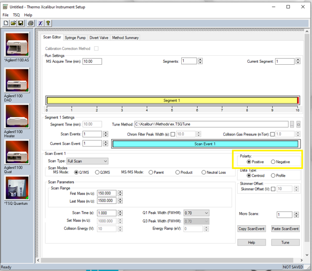

# Agilent 1100 (DAD) LC with Thermo Fisher LTQ Quantum Ultra MS/MS
090723MB01

>**For urgent problems please report to Matt Burleson, AP 346, mburleson@wcu.edu, x2239!***

# Scope

This SOP details the operation of the Agilent 1100 LC and Thermo Quantum MS as a coupled system.  The LC can be operated without the MS which is detailed as a separate document.

# Gases and Startup
1. The LC-MS uses both argon and nitrogen gases.  The argon should only be on if performing an MS/MS experiment, and can be turned on using the main valve of the cylinder and the quick connect valve towards the back of the mass spec.  The nitrogen should already be flowing in the lab.
1. The power switch to each module of the LC is located on the lower-left front of each module.  Press these if the modules are not already on.

# Login
1. If you have not already done so, reserve the instrument and log your time using it.  Please check the calendar first to make sure no one else has reserved it.
1. Login to Windows using the username **labuser** and the password **labuser**.
1. The software to control the unit is **Xcalibur**.  Open the **Xcalibur** software by clicking on the shortcut on the desktop that is shown below.
      
1. The main window of Xcalibur (roadmap) is shown below.  **Instrument Setup** and **Sequence Setup** will primarily be used.
      
1. Ensure all modules of the LC, and the TSQ Quantum, appear in the "Status" window to the top-left of the Xcalibur window as shown below.
      

# Preparing the Instrument
1. Ensure there is enough mobile phase for your analysis in the mobile phase bottles on top of the instrument.
      > *NEVER let the mobile phase level get below the level of the filter in the bottle! NEVER let air get into the LC plumbing!*

1. The LC lines must be purged with the necessary mobile phase prior to use.  Open the purge valve of the LC pump by turning the purge valve counterclockwise.
1. In the main window of Xcalibur, click "Instrument Setup" shown below.  The Instrument Setup popup will default to the autosampler selected since it is the module that communicates to the mass spectrometer.
      

4. In the Instrument Setup popup, click the "Agilent1100 Quat" icon in the left-hand toolbar to select the pump's setup window as shown below in yellow.
      
1. Click "Agilent1100" in the top toolbar followed by "Direct Control..." to open the Direct Control window shown below.
      
   
1. Change the "Flow rate" to 5.00 mL/min, and the composition to be an even split of the lines you are using.  For example, if using lines A & B, they would be set to 50:50.  If using all four lines, they would be 25% each.
1. Click "Start Pump" to begin purging the mobile phase.  The pump may take a moment to start pumping.
1. Allow the pump to purge for ~5 mins.
1. Once the lines have been purged, change the composition and flow rate to that of the starting conditions of your method.
1. Close the purge valve to begin equilibrating the column to the initial conditions.
1. Close the Direct Control window by clicking the "X" in its top-right corner.

12. Back in the Instrument Setup popup, click the icon labelled "Agilent1100 DAD" in the left-hand toolbar to access the DAD's setup window shown below.
      
1. Click "Agilent1100" in the top toolbar followed by "Direct Control..." to open the Direct Control window shown below.
      
1. Use this window to turn on the UV Lamp by selecting "Lamp On."  Wait until the "Lamp status" reads "On" before proceeding.
1. Close the Direct Control window for the DAD.

# Creating/Loading A Method
## Loading A Method
1. Within the roadmap window, load your method by clicking on **File** then **Open.**  Locate your method and select it.

## Creating A method (**Advanced**)

### Autosampler

1. If you need to create a new method, click "Instrument Setup" within the roadmap window. The Instrument Setup window defaults to the autosampler module.
1. Change the Injection Volume, shown below in yellow, to that of your method.
      
1. Click the "Timed Events" tab.

4. The autosampler needs to be set as the "Start instrument" which is responsible for telling the rest of the system the injection has been made.  Complete the table so that it matches that shown below.
      
1. Save your method.

### Detector
1. Click the icon for the DAD in the left-hand toolbar to open the DAD's setup page as shown below.
      
1. Ensure that "Lamp On" and "Autobalance" are both checked.
1. "Peak width expected" and "Slid Width" default values will load automatically, but can be changed by clicking their respective dropdown arrows.
1. Under "Enable UV Acquisition", click a check beside the channel that will be used for analysis.  For example, if only using one wavelength use Channel A.  If using two wavelengths, use Channels A & B, etc.
1. Change the wavelength to that of your method under the Wavelength tab in the UV Channels table.  The reference wavelength and bandwidths can also be changed as necessary.

6. Add a row for the ending time of your method and be sure the parameters match that of the previous step.  Repeat this for each wavelength being analyzed.
      > ***Advanced** A spectrum scan (locating lambda max) can be enabled by checking its respective checkbox.  The starting wavelength, ending wavelength and step can then be entered.

1. The final result should be similar to that shown below.
      
      >*For the DAD, and remaining modules of the LC, a new row will automatically show up with an asterisk for a time you did not enter.  That is fine, proceed to the next step.

1. Save your method.

### Heater
1. Click the icon for the Heater in the left-hand toolbar to open the Heater's setup page as shown below.
      
1. Ensure that "Separate mode" is enabled.
1. No boxes should be checked under "Valve Switching."
1. Under both "Left/Right Temperature", enter the temperature of your method.
1. Add a row for the ending time of your method and be sure the parameters match that of the previous step.  The final result should be similar to that shown below.
      
1. Save your method.

### Quat Pump
1. Click the icon for the Quat in the left-hand toolbar to open the Quat's setup page as shown below.
      
1. Add the information of your mobile phases to each respective line.
1. Click the "Gradient Program" tab to open the gradient setup window.
1. Under the "Flow" column, enter the flow rate value of your method.
1. Click the value under the column headers to change the composition to that of the method starting conditions for time 0.

6. In the next row, change the time and percentages of each line as necessary to match the method.  Repeat this step as necessary.  The final result should be similar to that below if using a gradient.
      
1. Save your method.

### Mass Spectrometer
1. Click the icon for the TSQ Quantum in the left-hand toolbar to open the mass spec's setup page.
1. The Scan Type can be selected based on the needs of the user by clicking the dropdown arrow beside "Scan Type" shown below in yellow.  The rest of this procedure is for a full scan analysis using Q1.  Q3 and MS/MS mode can be enabled here.
      
1. The image below shows where to locate the Polarity.  Change the Polarity of the MS to either positive or negative by clicking the respective button beside the option.  
      
1. Change the **MS Acquire Time** to match that of your LC method.

5. Change the **Scan Ranges** (below in yellow) to scan for the desired masses, and scan time to be 0.2 for the fastest scan speed for the desired mass range.  It's okay if the software changes that value accordingly.
      

6. The image below shows where to locate the Tune Method.  Change the Tune Method to the appropriate tune file.  You have to first clear the directory listed by "Tune Method" before the ellipsis will allow browsing.
      
1. Once the MS parameters have been adjusted, save the method and close the Instrument Setup window.

# Prepare A Sequence
1. At the Xcalibur roadmap, click **Sequence Setup.**  The default window is shown below.
      
1. Within the sequence table complete the following for each of your samples:
    1. Under Sample Type, click to select either a Blank or Unknown.
    1. File Name will be a unique data file given to each injection.
    1. Sample ID can be the actual name of the sample.  For example, MeOH.
    1. The Path is where the data is stored and should be set to the default of...
    1. The Inst Method (instrument method) can be selected by right-clicking within the row and selecting Browse.  Locate the method that was created previously.
    1. Position is the location of the sample in the HPLC autosampler.  Update the positions of samples accordingly.
    1. The Injection volume should match that of the method.
    1. Repeat this as necessary for all samples.
1. A sequence template is shown below.
      
      >*NOTE: Always begin a sequence with at least TWO blanks and always end a sequence with at least ONE blank.

1. Save the sequence once you have finished.

### Analyze Samples
1. To submit the sequence to the instruments, click the **Run Sequence** icon at the top toolbar.  The icon is shown below.
    
1. A new window will open.  Ensure the following are correct.
  1. The "Agilent1100 AS" is checked as the Start Instrument.
  1. "Run Rows" matches the number of rows you created in your sequence.
  1. "Start When Ready" is checked.
  1. "After Sequence Set System" is set to "Standby."
1. The window should be similar to that shown below once completed.
    
1. Click **OK** when done to submit the sequence to the instruments. In the left-hand panel, you should observe status change from **Ready to Download** to **Waiting for Contact Closure.**  This means the MSD is waiting for the LC to complete the injection.

# Analyzing and Exporting Data
1. Open the QualBrowser software from the desktop.  The icon is shown below.
    
1. Click "File" followed by "Open Sequence..." and locate the sequence you submitted.  Once located, the screen should look similar to that below.
    
1. Double-click on the datafile for the sample you wish to process.  The TIC of that sample should display as shown below.
    

4. To view the UV, complete the following:
  1. Locate the pin icon in the top-right corner of the TIC window and click it.  The pin should turn green.
  1. Right-click within the TIC, and select "Ranges..." to open the Chromatogram Ranges window shown below.
      
  1. Click the checkbox under "Type" to add a new range.  It will default to TIC and should turn blue.
        
  1. Under "Detector", click the dropdown arrow and select UV.
        
  1. Select the peak algorithm you want to use by using its dropdown arrow.  Use the Peak Detect list on the Identification page to specify the type of peak detection algorithm between ICIS or Avalon to use to analyze raw data. These algorithms also apply smoothing, construct a chromatogram using the scan or mass filters, assign peak numbers, generate a peak list, and determine the peak start and peak end points. All algorithms provide component peak detection and chromatographic peak detection. The ICIS algorithm is used for MS data (Genesis is legacy detection and should **NOT** be used). **The Avalon algorithm is used for PDA, UV, and analog data**.
  1. Click "OK."
1. To click around on the TIC once the UV has been loaded and see the resulting mass spectrum, click the pin icon in top-right corner of the mass spectrum.  It should turn green.
1. You can now click around on the TIC and see the resulting mass spectrum.

# Shutdown
1. When you are finished with the instrument, ensure the MSD is in standby mode with the argon gas turned off (if used).
1. Make sure there is no flow from the LC and that the detector lamp(s) is off.  Both of these can be adjusted from the Direct Control windows mentioned above.
1. You may close all programs.
