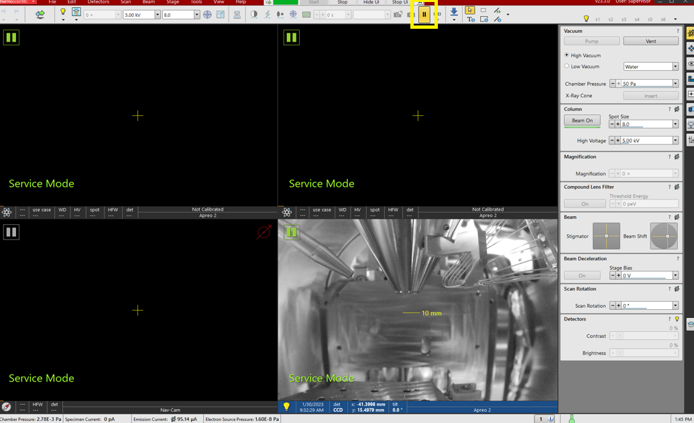
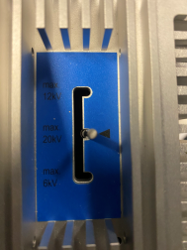
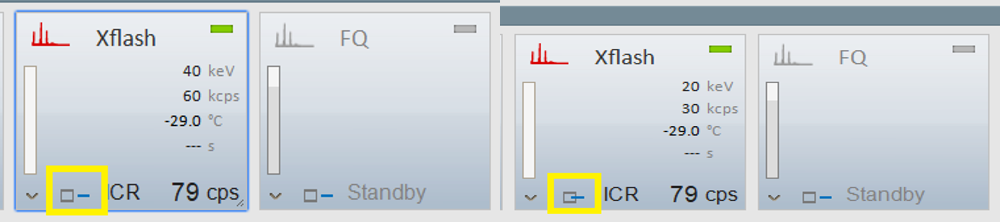
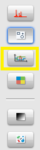
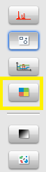
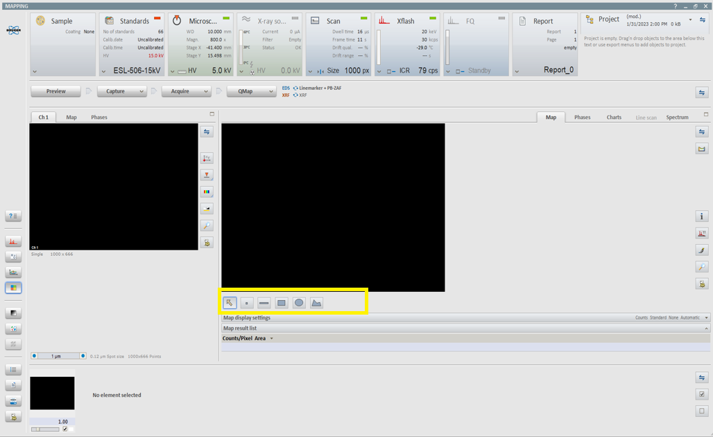
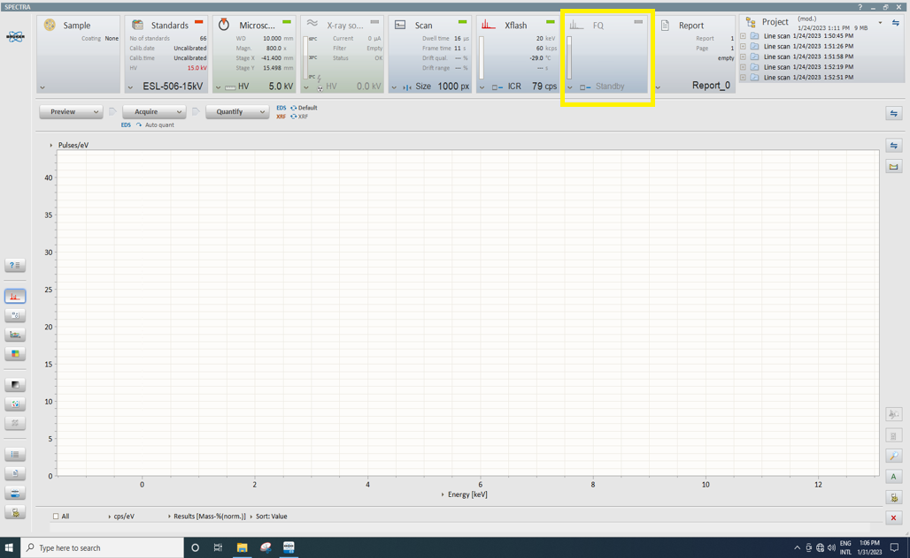

# Thermo Apreo 2 SEM with Bruker Detectors SOP
10122023MB01
>**For urgent problems please report to Matt Burleson, AP 346, mburleson@wcu.edu, x2239!***

# Definitions
1. **Standard Lens Mode** - A single lens mode that gives a large depth of focus with a small convergence angle.  The resolution is the weakest because the beam is focused so high up.  The ETD detector should be used for secondary electrons and T1 or DBS (optional) for backscattered electron imaging.
1. **Optiplan Lens Mode** - The default lens mode.  Optiplan lens mode adds an acceleration tube that is powered up to 8 kV.  When the electrons leave the column, they decelerate back to the starting voltage.  This acts as a fast lane for the electrons leading the electrons to have less time to repel each other, thus increasing resolution.  The second lens does the focusing.  The accelerating tube also pulls electrons back up into the column – which activates the in-column detectors (trinity detectors, detailed below), thus competing with the ETD.
1. **Immersion Lens Mode** - Similar to Optiplan lens mode, the immersion lens mode adds another lens (electromagnetic vs Optiplan's electrostatic) leading to the highest resolution, but least depth of focus.  Magnetic samples **CAN NOT** be imaged in immersion mode.
1. **Compound Lens Filter** - Combines electrostatic and magnetic immersion technology improving contrast with energy and charge filtering for imaging of insulating samples.
1. **Trinity Detectors** - Three in-column detectors.  These are further detailed below.
  1. **T1 detector** - The in-column backscatter (high angle) detector consisting of two segments (A & B) that can be assessed individually or in combination.  This detector is the closest to the sample.  A - B configuration will be good for topography while A + B will be good for material contrast.
  1. **T2 detector** - Secondary electron detector (middle angles and energies) that is a scintillator type detector.  Higher up in the column than T1, thus providing a strong compositional contrast.
  1. **T3 detector** - Secondary electron detector that is a scintillator type detector and highest up in the column.  This detects the lowest energy back-scattered electrons and is also the most collimated.  This detector is the most surface-sensitive detector, analyzing ~ 10 nm of surface layer and therefore can only be used in high-vacuum mode.
1. **ABS/CBS Detectors** - Angular/Concentric backscatter electron detectors.  The **inner rings** collect the signal on-axis with the primary beam which contains mostly channeling or atomic contrast information.  The **outer rings** collect large-angle backscattered electron signal containing mostly topographic information.
1. **STEM3/STEM3+** - Scanning transmission electron microscopy.  The primary difference is the segments of the detector being utilized. Both allow the analysis of bright field, dark field and HAADF (STEM3+ has **four** dark field segments compared to STEM3's one).
  1. **Bright field** - Sample contrast comes from absorbance of light in sample.  The background is white as the light source and condenser are arranged to fill the objective’s aperture completely with unscattered electrons, thus regions within the sample that are thicker/denser will appear darker.
  1. **Dark field** - Sample contrast comes from light scattered by sample.  No direct light enters the objective; the source waves pass by; the background is dark.  Only where the sample features diffract, refract, reflect or disperse the incoming light do they become visible.  Dark field is good for elemental contrast and grain boundaries.
  1. **HAADF** - High angle annular dark field - This mode collects diffracted or scattered electrons.  The image will contain elemental contrast information (similar to backscattered electrons), but it will not contain grain boundaries detail.
1. **Scan Interlacing** – Splits an imaging area into a large number of blocks defined by the number of lines (2 to 8).  The first line of each block is scanned, followed by the second one, etc.  This imaging method significantly reduces sample charging.  Scan interlacing **cannot** be used simultaneously with line integration.
1. **Line Integration** – scans each line repeatedly several times (from 2 to 512) before proceeding to the next line. Signal data collected from these passes are integrated and displayed as an actual image line. This imaging method reduces sample charging (in comparison with single pass with longer dwell time) and improves overall image quality.
1. **Drift Correction Frame Integration (DCFI)** - Corrects imaging drifting and charging when integration filter is active.

# Definitions Continued
11. **Beam Deceleration Mode** - **High vacuum only** - an optical mode where the specimen is biased with a negative potential and primary electrons are decelerated before they land. The electrons generated by the primary beam are accelerated from the specimen, and as a result detected at higher energy than emitted.  The landing energy (EL) can be determined by (Acc.voltage – StageBias).  The specimen is part of the optical system and therefore must be mostly flat and parallel with the detector.  Very low to little signal in the ETD. Using BD mode a focusing lens is created between the negatively biased specimen and pole piece or detector above resulting in all the signal electrons accelerated towards the column or backscatter detectors as shown below.

1. **Crossover Mode** – The onscreen image shows an aperture projection instead of a sample, thus showing the electron source position instead of the sample surface for beam alignment.
1. **Mains Lock** – When enabled, the scanning is synched with the mains AC oscillation. This greatly diminishes blurring and jittering of the electron imaging, resulting in smooth image edges at higher mags with slow scan conditions.

<b>The rest of this page intentionally left blank.</b> 

## Thermo xT Microscope Software
### Software Startup and Loading of Sample
1. Check the Spicer Counseling Cancellation System behind the desk.  You should see **"Field OK"** on the display.  Alternatively, the sensor on the right side of the instrument can also be checked for the green light.  Press the **Cancel-Standby** button below in yellow once or twice if the field ok is not displayed.

1. Ensure the PC under labelled "Microscope PC" under the table is on.
1. The Thermo software should always be started first (before Bruker's).
1. Use the **User** login for Windows.  The password is **user.**
1. The Thermo controlling software for the microscope can be started by clicking **XT Microscope** icon on the desktop.
      
1. The server GUI will open, so click **Start** under microscope to continue the software launch.
      
1. Once the microscope controlling software popup asks for the username and password, double-click the top of the xT Microscope Server GUI to minimize it.
1. The password and username for the microscope software are both **"Supervisor."**  The software will complete loading.
1. The software may ask you to home the stage.  Click **Yes.**

10. The software window has four quadrants that can each be changed for your convenience.  A typical layout is for the top-left and top-right quads be set for the SEM & detectors (indicated by the atomic icon in the bottom-left of each quadrant), the bottom-left for the NAV-Cam (indicated by a compass), and the bottom right for the CCD camera inside the chamber (indicated by a light bulb).  To change the quad, click the icon in the lower-left corner of the desired quad, and select what you'd like from the list of options.  This is shown below.

1. The chamber can be pumped down or vented for sample loading using the Vacuum control section of the Thermo software.  The sample chamber door pulls out horizontally from front of instrument.

      >The window above is the Beam Navigation window that is selected by clicking the atomic model icon in the far-right toolbar.

1. Vent the system by clicking **Vent** to load your sample.

13. Once the sample has been loaded, and the chamber closed, click **Pump** to pump down the chamber.  You have the option to choose between low or high vacuum, and should pick your desired vacuum level.  
>Be sure to check "Magnetic Sample" if your sample is magnetic.  This will disable features of the immersion lens mode.

14. Click **No Accessory** in the subsequent window to begin the pump down process.
1. You will need to wait until the chamber icon in the bottom toolbar is completely green before proceeding.  This is shown below in yellow.  The computer will make a noise to indicate the pump down has completed.
      
1. The instrument will automatically take a Nav-Cam photo, which can be edited.
1. Close the Sample Exchange window.

### Labeling Your Sample for Nav-Cam
1. To label your sample in the automatically acquired Nav-Cam photo, click the **Navigation** tab in the far-right toolbar as shown below.
      
1. The current list of positions, if any were saved, are shown in yellow below.
      
1. Back in the Nav-Cam quadrant, double-click the location of your interest.  You will see the green crosshairs move to this position.
1. Click **Add** to the right of the positions shown above.  This will create a new position on the sample in Nav-Cam quadrant.
1. Double-click the position name to change it.
1. Click **Update** followed by **Yes.**
1. Repeat this for each area of interest for easy sample navigation.

### Initial Focusing of Sample
1. Once the chamber icon is completely green, you will need to focus your image and link the Z-axis.  Click the **Navigation** tab in the far right toolbar and type in **45** in the Z-axis to bring the stage up.
>The escape key can be used at any time to stop the stage moving.  45 mm is a safe distance from the pole piece.

2. It is recommended to use the Optiplan lens mode.  This can be selected by clicking **Select Use Case** followed by **Optiplan,** which is the second option down.

      > Alternatively, you can click "Use Case" within a beam control enabled quadrant and select the appropriate lens mode.

3. Under Beam Control, set the beam conditions to 5.00 kV accelerating voltage and 50 pA beam current as a good starting point.

1. Click **Beam on** under Column to turn on your electron beam.

1. Click anywhere in the first quadrant window (or any quadrant that has beam control enabled) followed by the **Pause** button (highlighted in yellow below) to see your initial image.

1. Use the **Auto Contrast Brightness** button to auto adjust your image.

1. For the initial focusing of your sample, use the **S1** preset shown below.

1. Decrease the magnification by rotating the magnification wheel on the MUI counterclockwise until you can visually see your sample.
1. Double-click your sample in the top-left quadrant to center that part underneath the beam.
1. Using the magnification wheel of the MUI, zoom in on your sample until features begin to appear.
1. Click on the **Reduced Area** button (shown below) in the top toolbar to display a smaller region (within a green rectangle). You can left-click and drag to adjust this area.

1. Focus on the reduced area using the focus adjustment controls on the MUI until the image is in focus.  Focus as best as you can. Always oscillate through focus to ensure you find the best condition.
1. If the image skews diagonally through focusing, fix the astigmatism with the stigmator controls.  Oscillate both the X & Y stigmator knobs (one at a time) until a crisp image is obtained.
1. Note the off-center crosshairs next to Beam Shift under Beam in yellow in the above image.  This should always be checked to ensure the crosshairs are centered.  To do this, right-click in the crosshair area of Beam Shift and select **Reset.**
1. Check the crossover of the beam by going to the Direct Adjustments tab shown in red below.
      
1. Under the Source Tilt section, click **Crossover** to change to the crossover view.  Click **Auto** to auto adjust the crossover.  Click **Crossover** again when finished.
      
1. Navigate back to the Beam Control tab.
1. Check the lens alignment by clicking the **Lens Alignment** icon in the top toolbar as shown below.

1. The window will change to show the wobble of the current alignment.  You will also see a green and yellow set of crosshairs.  Left-click and drag the green crosshairs up/down and left/right to minimize the wobble (movement in x-y range) of the image.  The goal is to make the image appear as if it's coming in/out of focus with as little wobble as possible.
1. Click the **Lens Alignment** button again to exit the Lens Alignment Mode.  Close the reduced area window.
1. With your image focused, click the **Link Sample Z** icon to establish where the Z-axis currently is (reset when the system is vented and dependent on the focal point which is changed during focusing).  The "Link Sample Z" icon is below.

1. Click the **Reduced Area** icon again to close the Reduced Area window.
1. Going back the Navigation tab, you will see the actual distance from your point and the pole piece.  Change the Z value to 10 mm for the optimum working distance on your focused image **IF IT IS NOT A BULKY SAMPLE**.
>**NEVER** move the stage without first activating the CCD for the chamber view.

### Choosing A Detector
1. The secondary electron detector (either the ETD or T2) is the default, but additional detectors can be selected.
1. To change the detector, click within an electron beam quadrant followed by the **Detectors** tab at the top of the software to open the menu of detectors as shown below.

      > Alternatively, you can click "DET" within a beam control enabled quadrant and select the appropriate detector.

3. Navigate to the **Detectors** icon on the far right toolbar (shown in the next image in yellow) for adjusting the settings as well as inserting/retracting the detector.
1. Click **Insert** under the Detector Settings window.  When you insert the STEM detector, you will be asked for the sample holder configuration.  Select the option that is appropriate for your analysis.  This is shown below after selecting the STEM 3+ detector.

> Use the "Horizontal Holder" option if doing STEM with or without EDS since the Bruker EDS will be used if desired.

5. The software will warn you that the stage needs to be moved, select **Yes.**

1. Any detector that was inserted following this procedure should be retracted after use.  **NEVER leave the instrument with a detector inserted when finished.**
1. To retract the detector, select **Retract** under the Detector Settings window.

### Capture An Image
1. With your sample focused and zoomed as desired, you can use the S4 scanning preset to capture the best possible image.

1. Holding the **Ctrl** key of the keyboard and **clicking the S4** scanning preset will enable DCFI (see definitions), line interlacing or line integration (if applicable).
1. You will notice the scan speed drastically slows down (increases the dwell time), increasing the signal to noise.
1. Press the **pause** button to stop the scan automatically once the entire region has been scanned.
1. With your image complete, click **File** followed by **Save All...**
1. Save your image in an appropriate location and format using the File Save Settings dialog.  For example, 16-bit TIFF images are default, but 24-bit should be used for colored images.
1. As you navigate on your sample, if any of the beam conditions (accelerating voltage and/or beam current) were changed, the workflow of beam shift adjustment, crossover check, lens alignment should be repeated with each adjustment.

# Imaging Tips
### Align feature
1. Allows the user to adjust the electron image so that a feature is brought to either the horizontal or vertical axis (user defined) to make navigation easier.
1. Click **Stage** followed by **Align Feature...**.  The Align Feature dialog will open.
1. On the quadrant of your choice, click and drag along an distinguishable feature in your image.
1. Back in the Align Feature dialog, select either the horizontal or vertical orientation and click **OK** to have the alignment procedure complete.

### Measurements
1. xT has measurement options for measuring features within your image.  These can be found under measurements shown below in yellow.

1. With these, you can measure feature sizes and angles.  The default color of these measurements is aqua, but can be changed using the Processing tab shown below in yellow.

1. When saving images with these measurements, ensure that **Overlaid graphics** is selected after clicking **Save All** and the format is a 24-bit TIFF.
1. Also within the Processing tab, the NavCam image can be digitally zoomed once its quadrant has been selected.  This will zoom in on the NavCam quadrant itself.

### Navigation Montage
1. Navigation Montage serves as a mini mapping of the sample within the xT Software.  Follow the steps below to use Navigation Montage.
1. Perform the initial focusing of your sample as described above.
1. Click **Stage** followed by **Navigation Montage...** towards the bottom of the dropdown menu.
1. The Navigation Montage setup dialog (below) will appear.  Select the quadrant that has your focused image in it.  In the example below, this is the top-left quadrant but you can select any quadrant that has beam control enabled.  Ensure **Use actual HFW** is checked.

1. Use the slider under **Result** to set the tiles of the resulting map you desire.
1. Under **Target Resolution**, 1536 x 1024 is the default and should be selected.
1. Click **Start** to begin the procedure.
1. When the procedure has finished, click the X in the top-right corner of the Navigation Montage dialog to close it.
1. When the procedure is finished, the quadrant you selected as the "take in display" will change to a navigation display(shown below in red).  Therefore, it is recommended to now use a different quadrant for imaging at your desired location (as shown below in yellow).  Click in any of the resulting tiles in the quadrant selected as the "Take in display" to navigate there.
  

  >**Warning** Clicking the pause button within the quadrant with the map will cause the map to be erased.

10. Acquire the image at the location as detailed previously.

# Maps Software
1. It is recommended to use a two screen setup when using Maps.  To do this, on the far-left monitor, press the **Input** button.  Press the button that is under the "DP" option shown.  To switch back to the normal setup, repeat the procedure but select the "DVI" option.
1. Loads the MAPS software.  Click **ThermoScientific** in the top-left corner and select **MAPS**.
1. The "Project History" dialog will load.  Click the **+** and fill out the new project details if acquiring new map data.  Be sure to save the maps in your data directory folder.  Click **Create** when finished to close the dialog.
1. The main window has a white circle and crosshairs.  The white circle represents the stage boundaries, the purple rectangle is current field of view and the purple "+" is the stage position.  These are shown below.

1. Go to **Microscope** and click **Import from NavCam**.  Select the correct NavCam display and it will be loaded onto the screen and into the "Layer" section to the left (you may have to click the down arrow to access it under Layer).  
>You can rotate the imported Navcam image by holding shift and clicking and dragging to rotate.  This is recommended to make the imported NavCam image identical to the NavCam image in xT.

6. Right-click in the NavCam layer to the left and beside "Alignment" click **Align**.
>**Make sure there is no stage rotation in xT before proceeding!**

7. The Alignment Wizard will open with the NavCam image.  Below the NavCam image, change number of points to 3 by clicking **3** in the red box below.

1. Back in xT, double-click to a distinguishable feature on the stage.  A number stamp on the stage or the tip of the arrows pointing towards the set screws are good options.
1. Focus on the image in quadrant 1 and select a distinguishable point, such as the arrow tip.
1. Back in MAPS and in the NavCam image under the Alignment Wizard, click and drag to move the image around and use the wheel of the mouse to zoom in to the same feature as in the previous step.  
1. Right-click on the feature that was focused on in the electron image and select **Place Point 1**.
1. Also within MAPS but in the left-hand side out of the Alignment Wizard with the white circle, locate the purple rectangle that is the current field of view from the microscope.  Click within the purple frame and then click the **camera icon** to take a snapshot from the quadrant in xT that was focused in the previous step.  The camera icon is shown below in yellow with an example of a snapshot.

1. Right-click on the center of the purple "+" and select **Place Point 1**.
1. Repeat these steps for points 2 and 3 and try to form a triangle across the stage for optimum alignment.
1. With the points selected, click the right-pointing arrow at the bottom of the Alignment Wizard (below in red) until it closes.  The alignment has now been completed.

1. Locate an area of interest on your sample in xT.  Adjust the focus, stigmation and link the Z-axis as necessary.
1. Click **Add tile set** (below in yellow) to add tiles for the mapping area of your choice.
>You have the option of rectangular, circular or freehand tile sets.

18. Click on the tile set under layer to open the tile set configuration bar shown below.
      
1. Within the Tile Set menu from the configuration bar (below in yellow), select **From Microscope** to import the microscope's current settings into the MAPS dialog after selecting the S4 preset in xT.
      
1. Click **Focus** (in yellow) and select a focus strategy by clicking the dropdown arrow and selecting your appropriate strategy.  A "Fixed" focus strategy will maintain the current conditions across the entire mapping region.  An "Interpolated" strategy will have you define the focus at three different points and is recommended.  The steps below detail the process of the "interpolated" focus strategy.
      
  1. Double-click on a grid displayed in MAPS to move there.
  1. In xT, focus the sample and check for stigmation.  Once these are satisfactory, click **set** besides "Point 1" back in MAPS.
  1. Repeat this for Points 2 & 3 moving across your sample.

20. Go to the **Advanced** tab (in yellow) and change order (in red) to **Serpentine**.

1. Go to **Job Control** at the bottom of the Maps window and ensure that "Turn Off Beam When Done" under **Post Acquisition** and "Stitch Tile Sets When Done" under **Post Processing** is selected.
1. Click **Run** to begin the acquisition.
1. When the acquisition has finished, you will see two new rows in the Layer section - A tile set labelled as "Tile Set (stitched)" and one labelled as "Tile Set" with green tiles next to it.  Click the "Tile Set" with green tiles next to it and click **Stitch this tile set** as shown below in yellow.
      
1. In the next window, fix any stitching issues.  Click **Confirm and Stitch** when finished.  A dialog will ask you to confirm that manual tile alignment is complete.  Click **Yes**.
1. The Stitching Job Options dialog will show, click **OK** to export your images after locating your data folder.
> Alternatively, you can use the Save image to file option, but note the software will have you draw an area to select the image.  This option is better if cropping is desired.  This is shown below.

## Bruker Detectors
Because the µXRF utilizes X-Rays, its SOP is treated as a controlled document by the Instrumentation Specialist.  The Instrumentation Specialist must be present for µXRF use.
### Bruker Computer login
1. Ensure the Bruker PC under the table is on.  It is set to automatically shutdown every Sunday, so it may be off.
1. Use the **User** login with **user** as the password.

### Software Startup and Objects Acquisition

1. Before anything, check the switch located on top of the FlatQUAD detector.  Set it to 20kV (indicated by a black arrow) if it is not already set as such.
 > **The FlatQUAD is a windowless detector meaning there is no window material protecting its detector elements.**

   
2. Double-click the software for Bruker, which is **Esprit 2.5.**
     
1. The username and password for Esprit are both **edx.**

1. Click **Login** to load the software.  A warning message will display stating one of the detectors is in standby mode (typically the FlatQUAD).

1. Click **OK** to continue the loading of Esprit, which is shown below.

1. With the software open, first select the acquisition type you wish to perform in left-hand pane of icons.  The options are simple spectrum, objects, line scans, mapping, simple image scan and processing, and feature analysis, respectively top to bottom.
     
     >**"Objects"** is the first option to allow you to see your microscope image while acquiring data.  Therefore, the instructions below are primarily for that acquisition mode.

1. Click the downward pointing arrow in the lower left-hand corner of **Sample** to launch the "Sample Properties" dialog.

1. Within **Sample Properties,** you will name your sample as well as provide a description of said sample.  Click **Ok** once you are finished.
1. Click the downward pointing arrow in the lower left-hand corner of **Scan** to launch the **Scan Configuration** dialog and ensure it matches that below (defaults).

1. Click **Close** when you have ensured all the parameters match.
1. Click the downward pointing arrow in the lower left-hand corner of **Xflash** to launch the "EDS Detector Configuration" dialog and ensure it matches that below (defaults).

  >Throughput is dependent on the beam current but the default is 30.  The maximum energy setting is the X-axis in the spectra and is 20 by default.

12. It is now time to move the EDS into acquisition mode.  Click the icon to the right of the downward pointing arrow in the left-hand corner of **Xflash** highlighted below in yellow.  If the line is outside of the box, the detector is in the parked position (left).  If the line is inside the box, the detector is in the acquisition position (right).

1. Focus your image as necessary using the Thermo software.  The working distance for the Xflash is 8.5 mm.
1. Click **Preview** within the Objects Acquisition Window to capture the current image from the microscope.

1. Clicking **Preview** will display a videoscope to allow the adjustment brightness, contrast and gamma (in red below) to produce the best quality image.  There is also an Auto feature which can be used if desired.  This display is shown below.

1. Click the dropdown arrow beside **Capture** and ensure that Capture Parameters is set to continuous as below.

1. Click **Capture** again to capture the image.
1. You can now select various points in the captured image to analyze using the options shown below for your area of interest by clicking and using them within the captured image.
      
>If you selected more than one area, be sure to click "Select all" to have all points analyzed.  Points can be selected/deselected using the yellow arrow in the above picture.

19. Click the dropdown arrow beside **Acquire** and ensure that Acquisition Parameters is set as below.  When **Save to file** is clicked you will have to navigate to the D (data) drive of the computer and save to your own folder.  You may need to click **Local** under "Volumes" to find this drive.  

1. Click **Acquire** to perform the acquisition.
1. In the event that elements are not automatically identified, click the periodic table icon shown below in red followed by **Auto ID** shown below in yello.

1. In the event that the automatic quantification doesn't show up, click **Quantify** to perform the analysis.  You can change the results to oxides by following the next steps.  
  1. Click **Quantify** to display the dropdown menu and select **Load.**
  1. A new window will appear with the available quantification methods as shown below.

    
  1. Select the quantification method of your choice (oxides in this case).
  

23. To display the results as the stoichiometric concentration, click the “**>**” beside results and select **Stoich. Concentration (norm.)**.

    >Note: This can be used for all EDS acquisitions  as well.

1. To save data, click on each icon shown below in red to the righthand sidebar to do **<u>BOTH</u> Add to Project <u>and</u> save the data.**
    

###  Line Scan Acquisition
1. Click the **Line Scans Acquisition** button (below Objects in the acquisition pane to the left-hand side of the software).
     
1. Click **Preview** within the Line Scan Acquisition Window to capture the current image from the microscope.  The image should always be updated to account for any possible drifting.

1. You can adjust the two points of the line as desired.

1. Click the dropdown arrow beside **Capture** and ensure that Capture Parameters is set to continuous as below.

1. Click **Capture** again to capture the image.
1. Click the dropdown arrow beside **Aclinescanacquiresure that Acquisition Parameters is set as below.
  
1. Click **Acquire** to perform the acquisition.

###  Elemental Mapping Acquisition
1. Click the **Mapping Acquisition** button (below Line Scan in the acquisition pane to the left-hand side of the software).
     
1. Click **Preview** within the Mapping Acquisition Window to capture the current image from the microscope.  The image should always be updated to account for any possible drifting.  

1. Click the dropdown arrow beside **Capture** and ensure that Capture Parameters is set to continuous as below.

1. Click **Capture** again to capture the image.
1. Click the dropdown arrow beside **Acquire** and ensure that Acquisition Parameters is set as below.

6. Click **Acquire** to perform the acquisition.
7. You can adjust the area of interest as desired using the buttons highlighted in yellow.

1. You can choose which elements are included by using the periodic table to the top right in the software.

### Gunshot Residue Analysis
1. With the sample(s) loaded in the microscope and the initial focusing completed as described above, change the beam conditions to the following:
  i. Use Case - OptPlan
  ii. Working Distance - 8.5 mm (for EDS)
  iii. Accelerating Voltage - 30 kV
  iv. Beam Current - 3.2 nA
  v. Detector - T1 (in-column backscatter) or dedicated backscatter
1. Zoom to a scale of ~30 microns.
1. In Esprit, select the **Feature Analysis** mode shown below.

1. Identify a particle by selecting the **GSR** sizing method.  Click the dropdown arrow beside **Sizing** followed by **load** as shown below.  Select the GSR method.

5. With the method loaded, identify the particles meeting the method's criteria by clicking **Sizing.**  Particles that are identified to meet the method's parameters will turn green as shown below.

1. To perform the EDS analysis on the identified particles, click **Chemistry/Reclassify.**  The analysis will be performed on each particle that was previously identified.
1. The class of particle can be assessed under the **Results** tab to the righthand side of the screen.
1. You can navigate between the spectra of each particle under the **Spectrum** tab next to the Results tab.
1. Results can be saved as previously described.

### Acquisitions with the FlatQUAD (FQ) Detector (**HIGH VAC ONLY**)
1. Before anything, check the switch located on top of the FlatQUAD detector.  Set it to 20kV (indicated by a black arrow) if it is not already set as such.
 > **The FlatQUAD is a windowless detector meaning there is no window material protecting its detector elements.**

   
2. Lower the accelerating voltage to 20 kV (or lower) in Thermo's software **first** if it's higher than 20 kV.
 > **The FlatQUAD should never be used with a beam accelerating voltage greater than 20kV!**

3. Park the XFlash EDS.
1. Lower the stage as low as possible (45 mm).
1. Initialize the FQ by clicking anywhere in its box highlighted in yellow below.

1. Click the downward pointing arrow in the lower left-hand corner of **FQ** to launch the **FQ Configuration.**

1. Change the Mode from **Standby** to **Normal operation.**
 > **Under vacuum ONLY!**

8. Change Cooling to **Thermostat** to begin cooling the detector.  The detector should be cooled before moving into the acquisition position.  The cooling will take ~20 minutes.  The "Cooling system" readback will go from **on** to **ok** when ready.  When the software is closed, the detector will start warming back up.
1. Move the detector to the acquisition position.
> If STEM is desired with the FlatQuad detector, insert the retractable STEM detector in first and the FlatQuad in last.  **Remember to activate the CCD as the FlatQuad is inserted!**

10. With the detector cooled, in the acquisition position and calibrated by the Instrumentation Specialist, follow the instructions above under **Software Startup and Objects Acquisition.**  The working distance for the FlatQuad is 10 mm.
> **The CCD should remain on at all times until data collection begins.  This will prevent touching the detector.**

11. To Shutdown the FQ, park the detector first.  Slect **Detector Cooling Off**.
1. Launch the FQ Configuration window.
1. Click **Standby** under "Mode" once the detector is at 15C.  **<u>NOTE: You must wait at least 20 minutes after the FQ has been put in standby to vent the chamber!!</u>**
1. Close the software.

# Exporting Data to Xenon
Once all data collection has been completed, follow the below instructions for exporting data to the Xenon share drive.
1. Locate your images and/or Bruker data files in their respective folders.
1. Copy all desired files to the folder labeled **Shared Data.**
1. On the left-most monitor, press the **Input** button at the bottom of the monitor itself.
1. Navigate to the **DVI** setting to select the Support PC (has icons along the left-hand side of the desktop).
1. Locate the **Shared Data** folder once more.
1. Select all of the files desired followed by right-clicking and selecting **Cut.**
1. In the toolbar of the window, type the following: **\\\xenon.wcu.edu** as shown below and press **Enter.**
   
You will be prompted for a username and password.  This is your **FULL** Catamount email and its respective password.
1. Locate the proper subfolder within the **Research** folder and **Paste** your data there.
