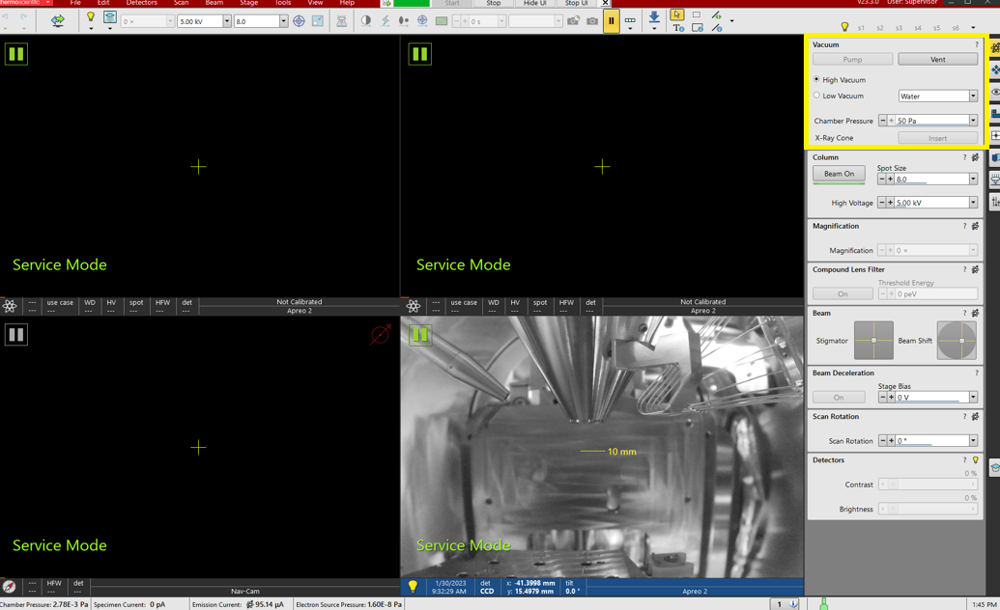
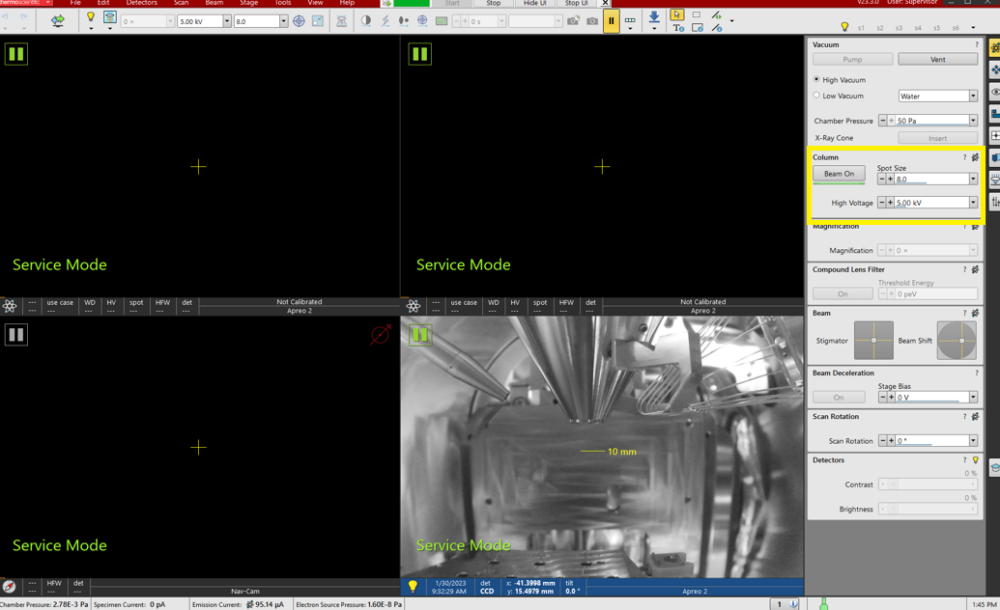

## Thermo Apreo 2 SEM with Bruker Detectors SOP
1312023MB01

### Thermo side
## Software Startup and Acquisition
1. The Thermo software should always be started first.
1. The Thermo controlling software for the microscope can be started by clicking "Start" in the toolbar located at the top of the desktop.
     
1. The password and username for the microscope software are both **"Supervisor."**  The software will complete loading.
1. The chamber can be pumped down or vented for sample loading using the Vacuum control section of the Thermo software.  The sample chamber door pulls out horizontally from front of instrument.
      
1. Accelerating voltage
      
1. Spot Size
      
1. Beam on/off
      

1. Click within a window to activate it.
1. The CCD should always be paused when not actively being used.
     

### Bruker Detectors
## Software Startup and Objects Acquisition
1. Before anything, check the switch located on top of the FlatQUAD detector.  Set it to 20kV (indicated by a black arrow) if it is not already set as such.
 > **The FlatQUAD is a windowless detector meaning there is no window material protecting its detector elements.**

   
1. Double-click the software for Bruker, which is "Esprit 2.5."
     
1. The username and password for Esprit are both "edx."
     
1. Click "Login" to load the software.  A warning message will display stating one of the detectors is in standby mode (typically the FlatQUAD).
     
1. Click "OK" to continue the loading of Esprit, which is shown below.
     
1. With the software open, first select the acquisition type you wish to perform in left-hand pane of icons.  The options are simple spectrum, objects, line scans, mapping, simple image scan and processing, and feature analysis, respectively top to bottom.  Click "Objects"
     
     >**"Objects"** is the first option to allow you to see your microscope image while acquiring data.  Therefore, the instructions below are primarily for that acquisition mode.

1. Click the downward pointing arrow in the lower left-hand corner of "Sample" to launch the "Sample Properties" dialog.
     
1. Within "Sample Properties", you will name your sample as well as provide a description of said sample.  Click "Ok" once you are finished.
1. Click the downward pointing arrow in the lower left-hand corner of "Scan" to launch the "Scan Configuration" dialog and ensure it matches that below (defaults).
     
1. Click "Close" when you have ensured all the parameters match.
1. Click the downward pointing arrow in the lower left-hand corner of "Xflash" to launch the "EDS Detector Configuration" dialog and ensure it matches that below (defaults).
     
>Throughput is dependent on the beam current but the default is 30.  The maximum energy setting is the X-axis in the spectra and is 20 by default.

1. It is now time to move the EDS into acquisition mode.  Click the icon to the right of the downward pointing arrow in the left-hand corner of "Xflash" highlighted below in yellow.  If the line is outside of the box, the detector is in the parked position (left).  If the line is inside the box, the detector is in the acquisition position (right).
     
1. Focus your image as necessary using the Thermo software.
1. Click "Preview" within the Objects Acquisition Window to capture the current image from the microscope.
     
1. Click the dropdown arrow beside "Capture" and ensure that Capture Parameters is set to continuous as below.
     
1. You can now select various points in the captured image to analyze using the options shown below for your area of interest.
      
>If you selected more than one area, be sure to click "Select all" to have all points analyzed.  Points can be selected/deselected using the yellow arrow in the above picture.

1. Click the dropdown arrow beside "Acquire" and ensure that Acquisition Parameters is set as below.  
      
1. Click "Acquire" to perform the acquisition.

##  Line Scan Acquisition
1. Click the "Line Scans Acquisition" button (below Objects in the acquisition pane to the left-hand side of the software).
     
1. Click "Preview" within the Line Scan Acquisition Window to capture the current image from the microscope.  The image should always be updated to account for any possible drifting.
     
1. You can adjust the two points of the line as desired.
1. Click the dropdown arrow beside "Capture" and ensure that Capture Parameters is set to continuous as below.
     
1. Click the dropdown arrow beside "Acquire" and ensure that Acquisition Parameters is set as below.  
    
1. Click "Acquire" to perform the acquisition.

##  Elemental Mapping Acquisition
1. Click the "Mapping Acquisition" button (below Line Scan in the acquisition pane to the left-hand side of the software).
     
1. Click "Preview" within the Mapping Acquisition Window to capture the current image from the microscope.  The image should always be updated to account for any possible drifting.
     
1. Click the dropdown arrow beside "Capture" and ensure that Capture Parameters is set to continuous as below.
     
1. Click the dropdown arrow beside "Acquire" and ensure that Acquisition Parameters is set as below.  
    
>Manual should be selected because collecting a map requires additional time and you don't know how long it will take with your counts.  You can’t add areas until the end (after), so you'd have to repeat.

1. Click "Acquire" to perform the acquisition.
1. You can adjust the area of interest as desired using the buttons highlighted in yellow.
    
1. You can choose which elements are included by using the periodic table to the top right in the software.

## Acquisitions with the FlatQUAD (FQ) Detector

1. Before anything, check the switch located on top of the FlatQUAD detector.  Set it to 20kV (indicated by a black arrow) if it is not already set as such.
 > **The FlatQUAD is a windowless detector meaning there is no window material protecting its detector elements.**

   
1. Lower the accelerating voltage to 20 kV (or lower) in Thermo's software **first** if it's higher than 20 kV.
 > **The FlatQUAD should never be used with a beam accelerating voltage greater than 20kV!**

1. Park the XFlash EDS.
1. Lower the stage as low as possible.
1. Initialize the FQ by clicking anywhere in its box highlighted in yellow below.
     
1. Click the downward pointing arrow in the lower left-hand corner of "FQ" to launch the "FQ Configuration."
     
1. Change the Mode from "Standby" to "Normal operation."
 > **Under vacuum ONLY!**

1. Change Cooling to "Thermostat" to begin cooling the detector.  The detector should be cooled before moving into the acquisition position.  The cooling will take ~20 minutes.  The "Cooling system" readback will go from **on** to **ok** when ready.  When the software is closed, the detector will start warming back up.
1. Move the detector to the acquisition position.
1. With the detector cooled, in the acquisition position and calibrated by the Instrumentation Specialist, follow the instructions above under **Software Startup and Objects Acquisition.**
