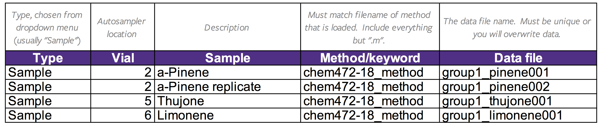

# Agilent 7890A GC with 5975C MSD and G1888 Headspace Sampler

032724MB02

>**For urgent problems please report to Matt Burleson, AP 346, mburleson@wcu.edu, x2239!**

# Book the Instrument (if not already)
1. Book your time on the instrument using the links on the website.

# Login
1. Open the MassHunter Software by selecting the icon labelled **GCMS** shortcut on the desktop.

# GC-MS/FID Operation (No Headspace)
## Load a Method

> *The "Method" file includes the parameters that tell the GC-MS how to operate.*

1. Go to **Method > Load Method**, choose your method, and click **OK**.
	1. All methods are stored on `D:/MassHunter/GCMS/1/methods/...`.
	1. If you are in a class, use the method your were instructed to use in class.

## Prepare a Sequence

> *The "Sequence" file includes the vial locations, file names, and descriptions of the samples.*

## For a single sample
1. Click the **Green Arrow** ar the top of the screen.
1. Enter the operator name.
1. Select the path to the data *folder* you wish to use. (All data are stored on the Data (`D:/`) drive.)
1. Enter a unique data file name for your sample.
1. Enter a sample name (date/your initials).
1. Enter a description of your sample in `Misc Info`.
1. Enter the autosampler position for your sample under **Vial**.
1. Ensure there is enough solvent is the wash vials you are using (usually Vial A) and fill them if not.
1. Click **OK and Run Method**.

## For multiple samples

1. Select **Sequence > Edit Sequence**.
1. Select the path to your data *folder* at the top left of the sequence window. (All data are stored on the Data (`D:/`) drive.)
1. Enter the the path to the *folder* that contains your method in the top middle of the window. (All methods are stored on the `C:/` drive, see Loading A Method above.)
1. Fill out the sequence table; an example is given below.

1. Click **OK** to exit the sequence table.
1. Click **Sequence > Save Sequence** to save your changes.
1. Ensure there is enough solvent is the wash vials you are using (usually Vial A) and fill them if not.
1. Select **Sequence > Run Sequence**, and then click **Run Sequence** in the popup.

# GC-MS/FID Operation with Headspace

## Opening Gas Valves
>The headspace also utilizes hydrogen carrier gas.

1. Open the **H2 cylinder shutoff valve** in the flammable gas cabinet and ensure there is ~60 psi going to the instrument.
1. Open the **N2 cylinder shutoff valve** to begin flowing N2 to the FID (makeup) and headspace vial pressurization.
1. After the gases are flowing, load the desired method and create a sequence by following the steps outlined earlier.

## Closing Gas valves
1. When the headspace analysis is finished, **close the cylinder shutoff valves opened in the previous step.**
1. Load the **Default method.**

# Analyzing Data

1. Open the data analysis software by clicking the "GCMS Data" shortcut on the desktop.
1. Select the file you wish to examine in the browser on the left of the screen.

> *For real-time analysis, click the **Snapshot (camera icon)** in the top shortcut bar to import the current data*

- Tips:       
    - *To zoom*: Left click and drag; double click to undo the zoom.
    - *To view a mass spectrum*: Right click, choose **Select** and the mass spectrum is displayed below.
    - *To find the retention times*: Right click on TIC and choose **Integrate**.
    - *To change the Y-axis from Abundance to % Relative Abundance*: Follow the step above to view a mass spectrum.  Locate the command line towards the top window and type "norm 100" followed by enter.  The spectrum will disappear.  Back in the command line, type "Draw 1,x" followed by enter to display the new spectrum.
	- *To integrate FID Data*: Follow the step above to view a chromatogram.  **Right-click** in the chromatogram and select **Enable Standard Data Analysis mouse actions.**  Zoom as necessary to see the start/end of the band, **right-click and hold** to drag the integration line from the start baseline and ending baseline.  Alternatively, the auto integrate function can be used by clicking **Chromatogram** in the top toolbar followed by **Autointegrate.**  Integration done automatically should always be inspected for quality (no baseline inflation, etc.)
	- *To view FID integration results*: Click **Chromatogram** in the top toolbar followed by **Integration Results.**

# Save/Export

1. You may print your spectra to the printer to paste into your lab notebook.
1. To export the spectra to Excel, MATLAB, R, Python, etc., right click on the item you wish to export (e.g. the chromatogram or the mass spectrum for a specific peak) and choose **Tabulate**.  In the window that opens up, select **Copy**.  Paste the copied text into a plain text file (for example, open Notepade and press **CTRL V**), and then save the file as `your_filename.tsv`.  The format is tab-delimited.

# Shutdown

1. Return the instrument to its standby state by selecting **Method > Load Method** and choose  `_Standby.M` (in the GC software).
1. Remove your sample vials from the autosampler and solvent from the wash vials and dispose of as hazardous waste.  Ensure your work area is clean.
1. Close the software and log out of the computer.

# Keep the Instrument Safe
1. All samples analyzed via GC-MS must boil below 250 ℃ unless your method is specifically designed to accommodate high-boiling point samples.
1. The GC-MS is only for liquid (or gas) samples (unless using the headspace sampler).
1. If you have a lot of particulates in your sample (e.g. a catalyst or drying agent), you must filter it.
1. Never inject aqueous solutions (they may damage the column).
1. Never inject strong acids or bases or acetic acid (they may damage the column).
1. Aim to have you maximum abundance in the chromatogram be ~2 million.
1. Don't override the solvent delay.
1. Never allow the oven to heat without carrier gas flow through any installed column.
