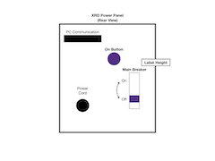

Rigaku Miniflex XRD Standard Operating Procedure
============================

# Safety

- **All users** must obtain X-ray safety training prior to using the instrument.
- All users must sign the log sheet prior to logging into the computer or turning the instrument on.
- Never attempt to turn on the X-ray source when the instrument is open.
- Never attempt to open the instrument when the X-ray is on (i.e. when the red light on top of the instrument and/or orange X-ray light on the front panel of the instrument will be **on**).
- Never attempt to defeat the safety interlocks on the instrument.
- Never adjust or change out any parts of the instrument.
- In an emergency, push the **red, round STOP button** on the front of the instrument.  Notify safety personnel (contact info in XRD binder) immediately.
- Always make sure the X-rays are off before opening the instrument.  Check that the red light on top of the instrument and orange X-ray light on the front panel are both **off**.
- Never touch the source; it contains beryllium, which is toxic.
- Do not operate the XRD in a manner other than specified in this SOP.

# Login

1. If you have not already done so, reserve time on the instrument calendar.

     > The instrument is available on a walk-up basis ONLY if no other users have scheduled time on the instrument.  Walk-in users still need to reserve time on the calendar and sign the paper log sheet.

1. Write your name on the log sheet and list your start time.
1. Log in to the computer.  Contact the Instrumentation Specialist for a username and password.  *Do not give out the username/password to other users!*

# Turn on XRD

1. Complete the steps under *Login*, above.
1. Turn on the XRD chiller (white box under counter to right of XRD).
1. Flip the **breaker switch** on the back of the XRD to **On** (up).  Look for the label on the left side of the XRD, reach around the back and flip the breaker switch up.
1. Press the **On button** on the back of the XRD (above and to the side of the breaker switch - see diagram).
     
1. Check that the *Ready Light* is illuminated on the XRD front panel.  If it is not lit, check the error indicators and notify the Instrumentation Specialist of the problem.  Do not proceed until the ready light is illuminated.
1. Slide open the door and place the sample slide in the clips on the goniometer.

     > Check that the X-ray lights are ***OFF*** before opening the door!

1. With the door closed and the ready light illumnated, press the **X-ray On** button on the XRD front panel.

# Conduct a Measurement

### Setup your Filepath

1. Open the Windows file browser and create a folder for your analysis.  Use a folder at `C:\[your folder]` (not on NEON) to avoid connectivity issues during the run.
1. Click in the navigation bar of the file browser and copy your file path using **CTRL-C** (or right click > Copy).
1. Go to the Desktop and open the **Standard Measurement** shortcut.
1. Paste the name of the folder you chose into the **Filepath cell** in the *Standard Measurement* window using **CTRL-V** (or right click > Paste).
1. Type a filename in the **Filename** cell.
1. Choose the scan type you (or your advisor) desires (full spectrum or slow scan).

### Setup your Measurement

1. Open the **Standard Measurement Condition** window (pointing finger icon).
1. Input the parameters you (or your advisor) desires.  Typical conditions are listed below.  
     - **Start Angle:** 3°
     - **Stop Angle:** 90°
     - **Scan Speed:** 0.5 ° min-1
1. Close the **Standard Measurement Condition** window.

### Execute your Measurement

1. Click the **Execute Measurement** button (top left corner) then click **OK** when prompted by a new window.

# Shutdown the XRD

1. When your run is complete, turn the X-rays off by pressing the **X-ray Off** button the front panel of the XRD.
1. Turn off the breaker
1. Open the sliding door and remove your sample.  Clean up any powder that may have spilled with a Kimwipe moistened with ethanol.

    > Ensure the X-ray indicator lights are OFF before opening the instrument!  
    >
    > Do not touch the X-ray source as it contains toxic beryllium metal!  Wash your hands immediately with soap and warm water if you do!

1. Enter your stop time on the XRD log sheet.
1. Allow the chiller to run for 30 minutes; come back and turn it off after 30 minutes have elapsed.

*Take all samples, slides, and supplies with you when leaving.*

# Analyze your Data

1. Navigate to your folder on the C drive (`C:\[your folder]`)
1. Open your data file in the **JADE** data analysis software.  You will find peaks.  You will be able to change the X-ray wavelength source here.
1. Save your file as a text (.txt) file.
1. Copy all of your files onto NEON.  *No flash drives are allowed in the XRD computer and it is not connected to the internet.*

     > Files kept on the computer for more than one academic year may be deleted without notice.

1. Close all windows and **log out of Windows**.
1. If you have not already done so, write your stop time on the log sheet.
